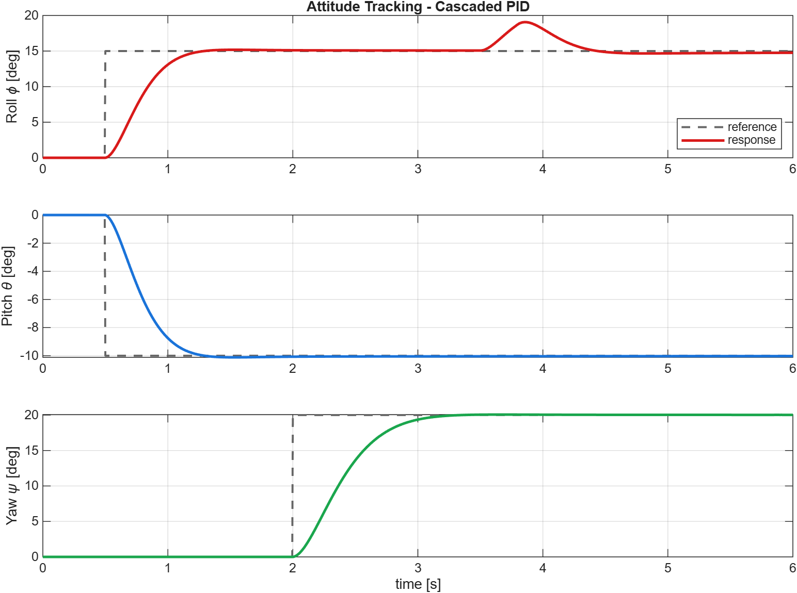
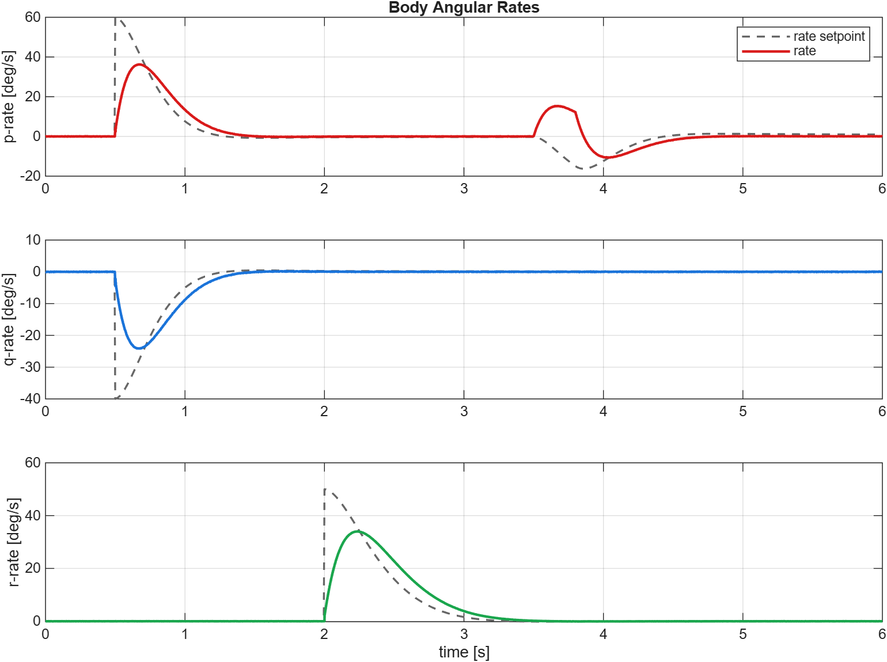
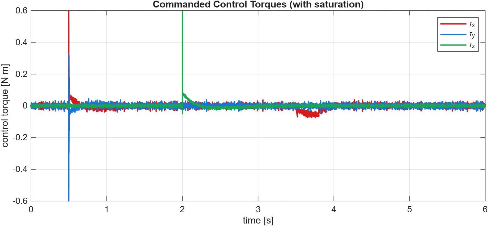
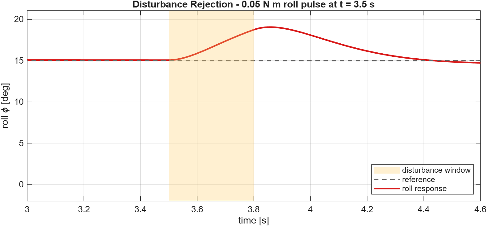

# Quadcopter Attitude Controller (Cascaded PID)

Attitude stabilization of a 0.5 m-class quadrotor using a cascaded
controller: an outer proportional **angle** loop generates body-rate
setpoints, and an inner **PID rate** loop generates control torques.
Gyroscopic coupling is modelled in the plant and compensated by
feedforward. The simulation runs a step-tracking plus disturbance-rejection
scenario at 1 kHz with measurement noise on the rate gyro.

**Author:** Ali Murtaza · **Type:** Personal project · **Period:** Apr-May 2026
**Tools:** MATLAB R2026a (no toolboxes required to run; Control System Toolbox optional)

## Architecture

```
ang_ref ──► [ outer P : Kp_ang ] ──► rate_ref ──► [ inner PID : Kp,Ki,Kd ] ──► τ ──► ┌─────────┐
              angle loop                              rate loop      + gyro FF        │  plant  │
        ▲                                       ▲                    + saturation     │ J ω̇ =   │
        │ angle feedback                        │ rate feedback (+noise)              │ τ − ω×Jω│
        └───────────────────────────────────────┴─────────────────────────────────── └─────────┘
```

- **Plant:** rigid-body rotational dynamics, `J·ω̇ = τ − ω×(J·ω)`, `J = diag(7.5e-3, 7.5e-3, 1.3e-2) kg·m²`.
- **Integrator:** fixed-step RK4 at 1 kHz.
- **Realism:** rate-gyro white noise (0.05°/s, 1σ), ±0.6 N·m torque saturation, integral anti-windup clamp.

## Results (roll axis, verified run)

| Metric | Value |
|---|---|
| Rise time (10-90%) | 0.45 s |
| Settling time (2%) | 0.69 s |
| Overshoot | 1.2 % |
| Steady-state error | 0.07° |
| Peak deviation under 0.05 N·m disturbance pulse | 4.07° (recovered to <0.5° in 0.80 s) |

### Figures
| | |
|---|---|
|  |  |
|  |  |

## Run it

```matlab
cd src
quad_attitude_sim
```

Outputs are written to `assets/` (four PNG figures, `quad_results.mat`, and
`attitude_trajectory.csv` used to drive the interactive 3D web viewer).

## What this demonstrates
Cascaded flight-control architecture, PID tuning for a crisp low-overshoot
response, gyroscopic decoupling, actuator saturation and anti-windup handling,
and quantitative closed-loop performance evaluation.

## License
MIT - see [LICENSE](LICENSE).
